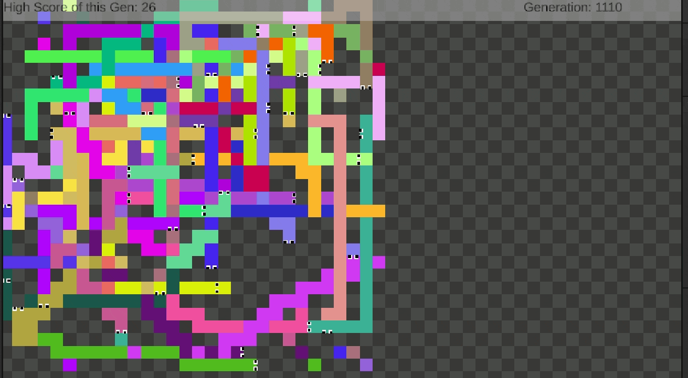

# Projet Snake IA:Reward Learning/Algorithmes Génétiques

## I. Présentation du Projet

Ce projet vise à développer un jeu Snake intelligent où le snake est contrôlé par une intelligence artificielle qui apprend et évolue grâce à des techniques d'apprentissage par renforcement (Reinforcement Learning - RL) et des algorithmes génétiques. Le but est de créer un snake capable de prendre des décisions complexes pour survivre le plus longtemps possible tout en mangeant de la nourriture.

## II. Mécanismes d'IA Implémentés

### Apprentissage et Mise à Jour des Poids :
#### Feedforward :
Les données d'entrée traversent le réseau de l'entrée à la sortie, permettant au snake de prendre une décision basée sur son state/weight actuel.

#### Reward and Punishment :
Après chaque action, une récompense (ou une pénalité) est calculée en fonction de si le snake s'est rapproché de la nourriture, s'il a mangé ou s'il est mort. Cela aide à guider l'apprentissage.
#### Mise à jour par Q-Learning :
Utilise l'algorithme Q-Learning pour mettre à jour les poids des perceptrons. Le réseau prédit les valeurs Q actuelles et futures, calcule l'erreur (TD-Error) pour l'action prise, puis ajuste les poids pour minimiser cette erreur.

### Évolution et Mutation :
#### Sélection et Croisement :
À chaque génération, les snakes les plus performants sont sélectionnés. Leurs poids sont croisés pour créer une nouvelle génération, introduisant de la variabilité et de meilleures stratégies.
#### Mutation : 
Avec une petite probabilité, les poids des nouveaux snakes sont légèrement modifiés pour introduire davantage de diversité génétique et éviter de rester bloqué dans des "local optima".

## III. Contrôles 

- **Snakes et environnement:** La plupart des valeurs pouvant être changés pour la génération des snakes sont dans le GameManager : Le nombre de snake généré, leurs vitesse, la limite de temps imparti, et même le score minimum à partir duquel les snakes sont visibles sont modifiable depuis l'inspecteur. La taille de la grille de jeu est en statique et doit être modifié dans le script.

- **Nombre d'inputs/outputs:** Le nombre d'input, d'hidden input et d'output sont directement modifiable dans le script du MLPNetwork. ***Attention, la save actuel ne marchera plus si le nombre d'input ne correspond pas à ceux enregistrer***. L'IA entrainé est à :

    public int numInputPerceptrons = 24;

    public int numHiddenPerceptrons = 30;

    public int numOutputPerceptrons = 4;

- **Save:** La save est nommé *"savefile.json"* et doit se trouver dans *"Assets/Save"*. Elle sera automatiquement loadé, ou générer, si elle n'existe pas. La save pré-entrainé se trouve dans *"Assets/Save/final_trained_ai"*.

## IV. Problèmes Rencontrés et Solutions Apportées

1. **Stall et Boucles:** Les snakes entraient dans des boucles infinies pour survivre sans chercher de nourriture.Ensuite, les snakes se collaient à la nourriture sans la manger. 
Dans ces deux cas, j'ai dû ajuster les récompenses pour encourager l'exploration et la consommation de nourriture. Plus il attends sans avoir pris de fruit, plus il sera pénalisé.

2. **Nombre d'Outputs Insuffisant:** Le snake ne disposait pas de suffisamment d'options pour prendre des décisions complexes. Je pensais avoir initialement besoin que d'un seul float, allant de -1 à 1. Et le snake devait tourner à droite, a gauche ou continuer tout droit selon le résultat de ce float. Mais cela ne donnait que trop peu de variabilité au mouvement du snake. J'ai donc augmenter le nombre de neurones de sortie pour permettre une plus grande variété de décisions.

3. **Finetuning:** Afin d'avoir un comportement qui s'améliorer avec les générations, j'ai dû modifier de maière empirique le score de fitness et le reward des snakes, ce qui est assez fastidieux.

4. **Inputs non pris en compte:** Les valeurs de mes inputs étaient trop complexes(position du snake/de son corps/fruit en bruts), mon jeu ayant un aspect aléatoire assez présent (spawn du fruit et des snakes), l'IA n'arrivait pas a faire sens de ces informations. J'ai donc modifié plusieurs fois ces inputs, jusqu'à trouver les bons ( visions à 8 directions au niveau de la tête du snake pour la nourriture, son corps, et le mur.)

## Sources:

- ["I Created The Perfect Snake AI With Reinforcement Learning" ](https://www.youtube.com/watch?v=FKE3fkDgI70)
- [AI Algorithm of Snake Game - Discussion on Reddit](https://www.reddit.com/r/programming/comments/5ly972/ai_algorithm_of_snake_game_share_opinions_if_you/)
- ["Neural Network Learns to Play Snake"](https://www.youtube.com/watch?v=zIkBYwdkuTk)
- ["Neural Network to Play Snake Game"](https://towardsdatascience.com/today-im-going-to-talk-about-a-small-practical-example-of-using-neural-networks-training-one-to-6b2cbd6efdb3)
- ["RL-GA: A Reinforcement Learning-Based Genetic Algorithm for Electromagnetic Detection Satellite Scheduling Problem" by Yanjie Song, Luona Wei, Qing Yang,Jian Wu,Lining Xing,Yingwu Chen](https://arxiv.org/pdf/2206.05694.pdf)
- ["Teaching AI to play Snake with Genetic Algorithm" by David Lyu](https://techs0uls.wordpress.com/2020/02/03/teaching-ai-to-play-snake-with-genetic-algorithm/)
- "Artificial Intelligence for Games Second Edition" by Ian Millington & John Funge

